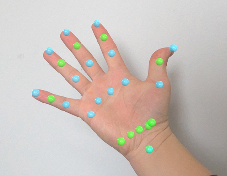
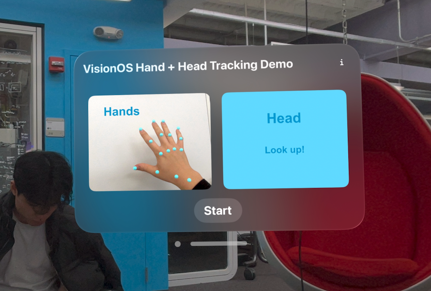

Head and Hand Tracking on the Apple Vision Pro
===========

I didn't find any minimal code examples for hand and head tracking on Vision Pro, so I wrote one. 

The app places markers on each hand joint (and one elbow joint), and places an object above you that tracks your head.

The code is written to be easily understood and extended — build whatever you want! Replace the spheres with cubes! Do custom gestures! (EDIT 4/21/24 added some convenience functions for simple gesture detection in AppModel.Swift)

The VisionOS needs an immersive space in order to do custom gestures / ARKit tracking, so you unfortunately won't be able to write gestures that work system-wide. I wanted to enhance the AVP navigational experience using new gestures, so please let me know if you figure out something that works. 

Have fun!

Contact
--------
https://andykong.org

Acknowledgements
--------
I started using the code from [here](https://github.com/FlipByBlink/HandsRuler).

More pictures
--------

### Start menu

### Both hand tracking, works with pretty weird poses too

### Elbow joint + hands

